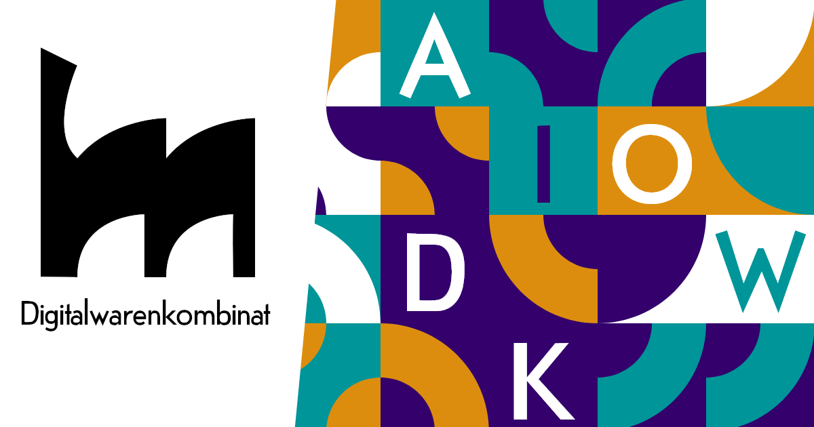

# Digitalwarenkombinat Website

The Digitalwarenkombinat (DIWAKO) is dedicated to the creative use of open cultural data and develops web applications and merchandise for and with GLAM institutions under the motto „Shaping digital worlds together“. We are committed to the sustainable use of open cultural data and support museums, galleries, archives and libraries in opening up digitally to the whole society.

Here you can find the source code for the [digitalwarenkombinat.de website](https://digitalwarenkombinat.de).
