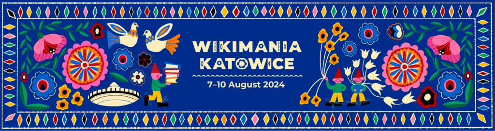

Vier vollgepackte Tage und über 1000 Menschen aus allen Bereichen des Wikiversums vor Ort in Katowice: das war die eindrucksvolle Wikimania 2024! Und wir waren als Digitalwarenkombinat dabei!

Nachdem wir uns im Frühjahr beworben hatten, um unser Projekt **GLAMorous Europe** (das ja passenderweise Wikidata einbindet) auf der Wikimania in Katowice vorstellen zu können und im Juni tatsächlich eine Einladung für einen Lightning Talk kam,
ging es im August dann tatsächlich nach Katowice.

Wir waren sehr gespannt auf die Konferenz, denn bisher hatten wir bis auf unser Projekt, die passive Nutzung von Wikipedia und Wikimedia Commons sowie ein paar Kontakte zu Wikimedia Deutschland kaum Berührungspunkte mit der Wiki-Community.
Was wir vorfanden, war sehr beeindruckend: 1000 Teilnehmende vor Ort, weitere 2000 online dabei und insgesamt waren Teilnehmende aus 130 Ländern anwesend. Neben parallel stattfindenden Vorträgen, Präsentationen und Diskussionen in 11 Veranstaltungsräumen fand zudem ein Hackathon während der Konferenz statt.

Ich für meinen Teil kann behaupten, noch nie auf einer so großen und so internationalen Konferenz gewesen zu sein.

Nach anfänglicher Überwältigung nutzten wir die Gelegenheit und besuchten einige Präsentationen und Talks von Engagierten (z.B. aus dem Projekt Wiki loves Folklore oder von Wikidata-Koordinator:innen), aber auch von kooperierenden Partnern wie dem Nationalmuseum in Kraków.

Unsere kurze Präsentation von **GLAMorous Europe** in Form eines 5-minütigen Lightning-Talk Show Cases sollte erst am dritten Tag der Konferenz stattfinden, wurde aber sehr ausführlich und empathisch vorbereitet.
Nach einem ersten kurzen Kennenlernen mit den Organisator:innen der Show Cases am ersten Konferenztag, konnten wir am Vormittag der Präsentation sogar noch einmal die Bühne antesten und alle Präsentationen durchgehen. So gut vorbereitet habe ich selten Konferenzpräsentationen erlebt. Aber das nahm allen Teilnehmenden auch die Aufregung und den Druck.

_Credit: Adjoajo, CC BY-SA 4.0, via Wikimedia Commons_

Unsere fünf Minuten des Fame gingen sehr flott und entspannt über die Bühne.
Das Video von unserem Auftritt findet ihr [hier bei Youtube](https://www.youtube.com/live/fRFuWtDKxwM?feature=shared&t=28492)

Unser Vortrag brachte uns direkt mit einigen Wikidata-Verantwortlichen ins Gespräch, woraus sich hoffentlich noch einige Optionen für die Weiterentwicklung und Nutzung von **GLAMourous Europe** ergeben werden.

Vier Tage voller Programm und Insights in diverseste Schwesterprojekte aus dem Wikiversum, von denen wir teilweise noch nie gehört hatten, zeigten uns wieder einmal, was für tolle Projekte von engagierten Menschen auf der ganzen Welt angestoßen werden. Und wo man selbst noch mitarbeiten kann.

Dank der recht neuen Onboarding-Optionen für Wiki-Einsteiger:innen nutzten wir den übergesprungenen Enthusiasmus und fingen direkt an, uns in das Bearbeiten von Wikipedia-Artikeln und Wikidata-Betitelungen reinzufuchsen.

Und das nächste Mal, wenn die Konferenz 2026 in Paris stattfinden wird, sind wir auf jeden Fall wieder mit dabei.

_Credit: Kasia Ostrowska (bazgra_nina), CC0, via Wikimedia Commons_
