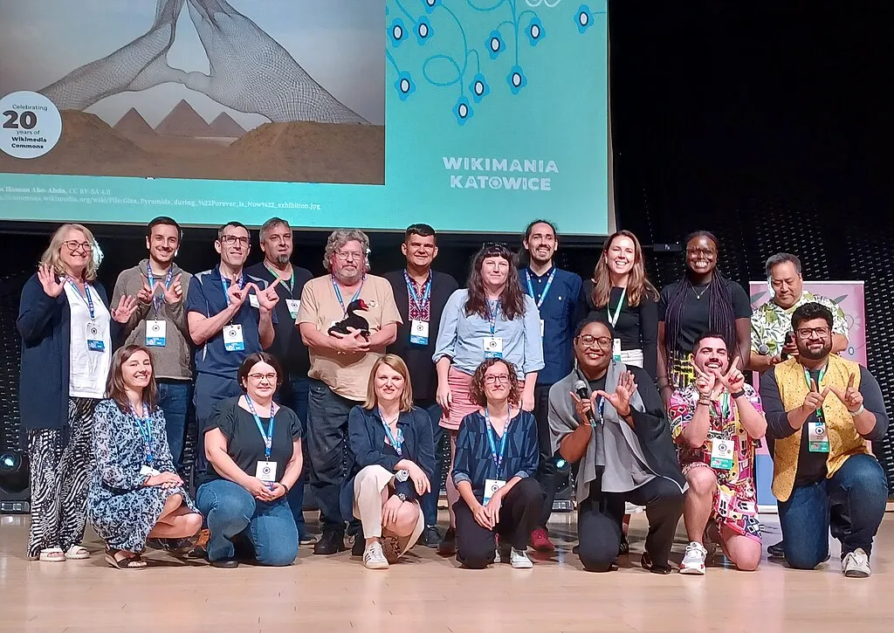

Vier vollgepackte Tage und über 1000 Menschen aus allen Bereichen des Wikiversums vor Ort in Katowice: Das war die eindrucksvolle Wikimania 2024! Und wir als Digitalwarenkombinat waren dabei!

Nachdem wir uns im Frühjahr beworben hatten, um unser Projekt [**GLAMorous Europe**](/projects/glamorous-europe/) auf der Wikimania in Katowice vorstellen zu dürfen und im Juni tatsächlich eine Einladung für einen Lightning Talk erhielten, ging es im August dann tatsächlich nach Katowice. (Wie es mit unserem Projekt weitergehen soll, erfährst du übrigens [**in diesem Blogbeitrag.**](/blog/wie-geht-es-weiter-mit-glamorous-europe)).

Wir waren sehr gespannt auf die Konferenz, da wir bisher außer unserem Projekt, der passiven Nutzung von Wikipedia und Wikimedia Commons und ein paar Kontakten zu Wikimedia Deutschland kaum Berührungspunkte mit der Wiki-Community hatten.
Was wir vorfanden, war sehr beeindruckend: 1000 Teilnehmende vor Ort, weitere 2000 online dabei und insgesamt waren Teilnehmende aus 130 Ländern anwesend. Neben Vorträgen, Präsentationen und Diskussionen, die parallel in 11 Veranstaltungsräumen stattfanden, gab es zudem einen Hackathon während der Konferenz.

Ich für meinen Teil kann sagen, dass ich noch nie an einer so großen und internationalen Konferenz teilgenommen habe.

Nach anfänglicher Überwältigung nutzten wir die Gelegenheit und besuchten einige Präsentationen und Talks von Engagierten (z.B. aus dem Projekt Wiki loves Folklore oder von Wikidata-Koordinator:innen), sowie von kooperierenden Partnern wie dem Nationalmuseum in Kraków.

Unsere Präsentation von [**GLAMorous Europe**](/projects/glamorous-europe/) in Form eines 5-minütigen Lightning-Talks sollte erst am dritten Tag der Konferenz stattfinden, wurde jedoch sehr ausführlich und empathisch vorbereitet.
Nach einem ersten kurzen Kennenlernen mit den Organisator:innen der Lightning Talk Show Cases am ersten Konferenztag, konnten wir am Vormittag der Präsentation sogar noch einmal die Bühne antesten und alle Präsentationen durchgehen. So gut vorbereitet habe ich selten Konferenzpräsentationen erlebt. Das nahm allen Teilnehmenden auch die Aufregung und den Druck.

_Credit: Adjoajo, CC BY-SA 4.0, via Wikimedia Commons_

Unsere fünf Minuten des Fame gingen sehr flott und entspannt über die Bühne.
Das Video unseres Auftritts findet ihr [hier auf Youtube.](https://www.youtube.com/live/fRFuWtDKxwM?feature=shared&t=28492)

Unser Vortrag brachte uns direkt mit einigen Wikidata-Verantwortlichen ins Gespräch, woraus sich hoffentlich noch einige Optionen für die Weiterentwicklung und Nutzung von [**GLAMorous Europe**](/projects/glamorous-europe/) ergeben werden.

Vier Tage voller Programm und Insights in diverseste Schwesterprojekte aus dem Wikiversum, von denen wir teilweise noch nie gehört hatten, zeigten uns wieder einmal, was für tolle Projekte von engagierten Menschen auf der ganzen Welt angestoßen werden. Und wo wir selbst noch mitarbeiten können.

Dank der neuen Onboarding-Optionen für Wiki-Einsteiger:innen nutzten wir den übergesprungenen Enthusiasmus und fingen direkt an, uns in das Bearbeiten von Wikipedia-Artikeln und Wikidata-Betitelungen reinzufuchsen.

Wenn die Konferenz 2026 in Paris stattfinden wird, sind wir auf jeden Fall wieder mit dabei.

_Credit: Kasia Ostrowska (bazgra_nina), CC0, via Wikimedia Commons_
