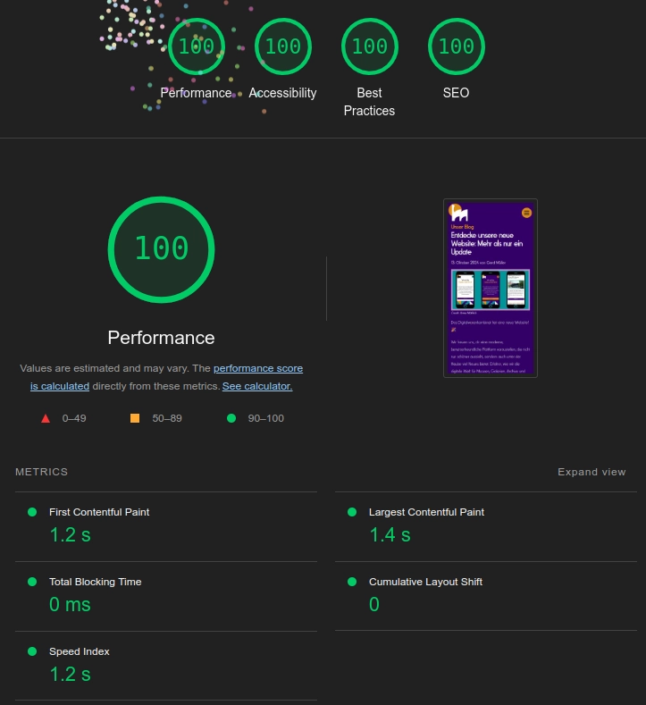

The Digitalwarenkombinat has a new website! 🎉

We are pleased to present our modern and user-friendly website, which not only looks better, but also offers many new features under the surface. In this blog article, you'll find out how we're making the digital world even more accessible for museums, galleries, archives and libraries (GLAMs) - and how you can benefit from it.

### Sustainability comes first

Environmental friendliness is important to us! That's why our website runs on Greensta's eco-hosting. This means: less CO₂ pollution and hosting that is kinder to the environment. The Green Web Badge on our website underlines this claim.

### Dark and light - just as you like it

Another highlight is our chic dark mode. You can now choose whether you prefer to browse in a light or dark environment. This is not only easier on the eyes, but also ideal if you visit our site in the evening.

### Open source - for more transparency and co-determination

Our work is based on open source solutions. This means that the software we use and develop is freely available to everyone. This encourages collaboration and enables us to share our digital tools with others who want to use them for their projects. Of course, this also applies the other way around. Transparency and community are therefor important to us.

### Blog - First-hand news

Our new [**Blog**](/en/blog/) keeps you updated! Here you will find interesting articles about our digital projects, tips on open source technologies and insights behind the scenes.

### Extended look behind the scenes

With our new website, we also want to give you a deeper insight into how we work. In our opinion, this promotes transparency towards project partners and clients. At the same time, we ourselves have a great interest in learning from the experiences of others and would like to help others learn from our experiences.

We have outlined our ideal working process, which we used for the development and realisation of our new website, in this diagram and describe the individual steps below:

_Plan:_ The entire development process begins with careful planning. We define the requirements, set priorities and create a clear roadmap for implementation.

_Code:_ The source code is maintained in an open source environment. We use Markdown to simplify the creation of content. This makes maintaining the blog more flexible and uncomplicated.

_Build:_ An automated build process ensures that the code is always clean and error-free. The website is broken down into its individual components and prepared for delivery.

_Test:_ To ensure the highest quality, we carry out end-to-end tests with Playwright. This is how we ensure that every function works smoothly and that the user experience works as planned.

_Release:_ All new features are thoroughly tested before each release. Automated processes ensure smooth releases and reduce sources of error.

_Deploy:_ After the release, the new code is automatically uploaded to our website via GitHub. This is how we ensure that all changes go live quickly and efficiently.

_Operate:_ The site is continuously monitored and optimised to ensure that it is stable and offers optimum performance - regardless of the time of day.

_Monitor:_ We use monitoring tools to continuously check the performance of our website, its security and accessibility. This helps us to recognise problems at an early stage and rectify them quickly.

We hope you like our new site as much as we do! Take a look around, discover our latest projects, such as [**GLAMorous Europe**](/en/projects/glamorous-europe/) and [**Blaues WundAR**](/en/projects/blaues-wundar/) and find out how we are using open cultural data to develop new ideas and help shape the digital future for cultural institutions.
