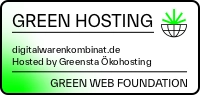
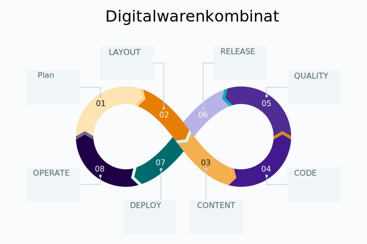
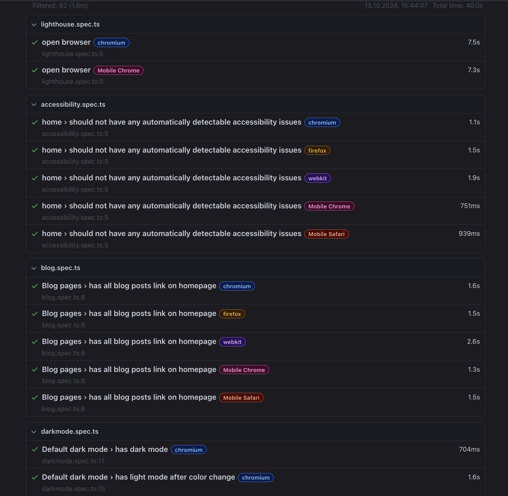
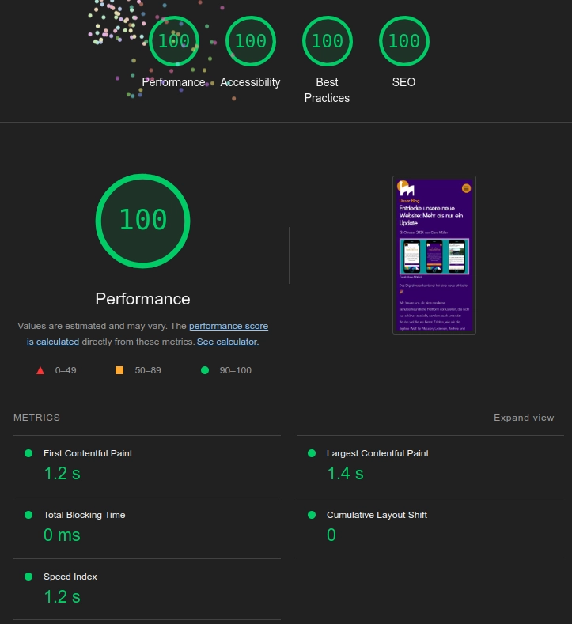

Das Digitalwarenkombinat hat eine neue Website! 🎉

Wir freuen uns, dir eine moderne und benutzerfreundliche Plattform zu präsentieren, die nicht nur besser aussieht, sondern auch unter der Haube viel Neues bietet. Erfahre, wie wir die digitale Welt für Museen, Galerien, Archive und Bibliotheken (GLAMs) noch zugänglicher machen - und wie auch du davon profitieren kannst.

### Nachhaltigkeit an erster Stelle

Umweltfreundlichkeit ist uns wichtig! Deshalb läuft unsere Website auf grünem Hosting von Greensta. Das bedeutet: weniger CO₂-Belastung und ein Hosting, das die Umwelt schont. Das Green Web Badge auf unserer Website unterstreicht diesen Anspruch.

### Dunkel und hell – wie es dir gefällt

Ein weiteres Highlight ist unser neuer Darkmode. Du kannst jetzt wählen, ob du lieber in einer hellen oder dunklen Umgebung stöberst. Das ist nicht nur angenehmer für die Augen, sondern auch ideal, wenn du unsere Seite abends besuchst.

### Open Source – für mehr Transparenz und Mitbestimmung

Unsere Arbeit basiert auf Open-Source-Lösungen. Das bedeutet, dass die Software, die wir nutzen und entwickeln, für jeden frei verfügbar ist. Das fördert Zusammenarbeit und ermöglicht uns, unsere digitalen Werkzeuge mit anderen zu teilen, die sie für ihre Projekte nutzen wollen. Transparenz und Gemeinschaft stehen dabei im Vordergrund.

### Blog – Neuigkeiten aus erster Hand

Unser neuer <a href='/blog/'>**Blog**</a> hält dich auf dem Laufenden! Hier findest du spannende Artikel rund um unsere digitalen Projekte, Tipps zu Open-Source-Technologien und Einblicke hinter die Kulissen.

### Erweiterter Blick hinter die Kulissen

_Plan:_ Der gesamte Entwicklungsprozess beginnt mit einer sorgfältigen Planung. Dabei definieren wir die Anforderungen, setzen Prioritäten und erstellen eine klare Roadmap für die Umsetzung.

_Code:_ Der Quellcode wird in einer Open-Source-Umgebung gepflegt. Mit Markdown vereinfachen wir die Erstellung von Inhalten, was uns Flexibilität und Einfachheit bei der Pflege des Blogs gibt.

_Build:_ Ein automatisierter Build-Prozess sorgt dafür, dass der Code immer sauber und fehlerfrei ist. Dabei wird die Website in ihre einzelnen Bestandteile zerlegt und für die Auslieferung vorbereitet.

_Test:_ Um höchste Qualität zu gewährleisten, führen wir sogenannte End-to-End-Tests mit Playwright durch. So stellen wir sicher, dass jede Funktion wie geplant funktioniert und die Benutzererfahrung reibungslos ist.

_Release:_ Vor jedem Release werden alle neuen Features gründlich getestet. Automatisierte Prozesse sorgen für reibungslose Veröffentlichungen und reduzieren Fehlerquellen.

_Deploy:_ Nach dem Release wird der neue Code automatisch über GitHub auf unsere Website gespielt. So stellen wir sicher, dass alle Änderungen schnell und effizient live gehen.

_Operate:_ Die Seite wird kontinuierlich überwacht und optimiert, um sicherzustellen, dass sie stabil läuft und eine optimale Leistung bietet – egal zu welcher Zeit.

_Monitor:_ Mit Monitoring-Tools überprüfen wir laufend die Performance unserer Website, ihre Sicherheit und Zugänglichkeit. Das hilft uns, Probleme frühzeitig zu erkennen und schnell zu beheben.

Wir hoffen, dir gefällt unsere neue Seite genauso gut wie uns! Schau dich um, entdecke unsere neuesten Projekte, wie <a href='/projects/glamorous-europe/'>**GLAMorous Europe**</a> und erfahre, wie wir die digitale Zukunft für Kulturinstitutionen gestalten.
