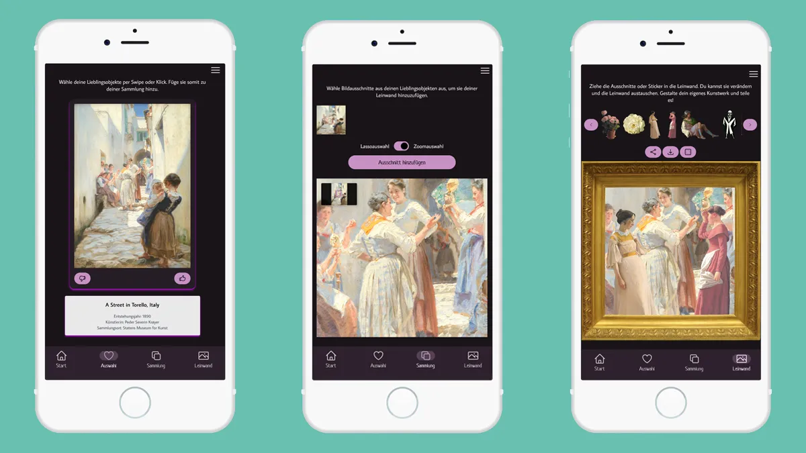

Nach rund sechs Monaten finanzieller Förderung durch den Prototype Fund ist der Prototyp unserer Webapp <a href='/projects/glamorous-europe/'>**GLAMorous Europe**</a> nun endlich live! Mit <a href='/projects/glamorous-europe/'>**GLAMorous Europe**</a> könnt ihr jetzt auf eine Entdeckungsreise durch die digitalen Sammlungen von Galerien, Bibliotheken, Archiven und Museen (auf Englisch abgekürzt: GLAMs) gehen. Dabei könnt ihr euch spielerisch mit dem gemeinsamen Kulturerbe auseinandersetzen, denn mit <a href='/projects/glamorous-europe/'>**GLAMorous Europe**</a> kann man nicht nur durch die Kunstwerke blättern, sondern auch Bildausschnitte freistellen und als Collage zusammenstellen. So entstehen ganz neue Kunstwerke.

Die Webapp ist so aufgebaut, dass ihr euch ganz einfach per Wisch-System (kennt man von einigen bekannten Dating-Apps) durch digitalisierte Sammlungen von Kultureinrichtungen navigieren könnt. Derzeit sind das vor allem Gemälde, aber auch Drucke, Skizzen, Plakate, Fotografien und Skulpturen. Alle diese Daten sind über eine Anbindung an Wikidata abrufbar. Das heißt, Kunstwerke, die beispielsweise direkt von Kulturinstitutionen bei Wikimedia Commons hochgeladen wurden und mit der Wikidata verknüpft wurden, können in GLAMorous Europe angezeigt werden. Wir haben uns dazu entschieden, nur Bilder in die Webapp zu laden, die über ein IIIF-Manifest verfügen. Dadurch können wir sicherstellen, dass die Bilder auch im nächsten Schritt des Projektes weiterverwendet werden können, auch wenn die Auswahl dadurch etwas eingeschränkt wird.

Als erstes wählt ihr in der **_Auswahl_** eure Lieblingskunstwerke aus, indem ihr nach links oder rechts wischt (oder auf "Daumen hoch" oder "Daumen runter" klickt). Danach könnt ihr in der **_Sammlung_** dann die hochauflösenden Bilder bearbeiten und Bildausschnitte auswählen, die ihr für die spätere Collage weiterverwenden möchtet. Das geht aktuell per grober Lassoauswahl und per Hintergrundfreistellung. Bei beiden arbeiten wir noch mit viel Elan an einer Optimierung. Mehr Infos dazu gibt's in einem der nächsten Blogbeiträge.

Im dritten Schritt könnt ihr auf der **_Leinwand_** eure ausgewählten Bildausschnitte sowie vorgeschlagene Sticker mit vorbereiteten Hintergründen und Rahmen kombinieren und somit eigene Kunstwerke erschaffen, die ihr dann teilen könnt.

Probiert den Prototypen gerne aus, entdeckt Gemälde, Drucke und Skizzen und erstellt am Ende euer eigenes Kunstwerk. Wir freuen uns, wenn ihr uns Rückmeldungen gebt.

Hier geht es zur Website [GLAMorous Europe](https://www.glam-europe.de/).

Mit dem Projekt-Launch endet leider auch unsere Zeit mit dem Prototype Fund. Wir haben in diesen sechs Monaten viel gelernt und ausprobieren können. Der finanzielle Support durch den Prototype Fund war dabei eben so wichtig wie die beiden Design-Coachings mit Lisa Steingräber von Superbloom. Ein großes Danke dafür!

Und natürlich machen wir mit dem Projekt <a href='/projects/glamorous-europe/'>**GLAMorous Europe**</a> weiter!
Wir haben schon ein paar Ideen, wie wir <a href='/projects/glamorous-europe/'>**GLAMorous Europe**</a> in Zukunft ausbauen können. Zum Beispiel denken wir daran, die Webapp für einzelne Museen zu optimieren und auf ihre eigenen Sammlungen anzupassen. Somit könnte <a href='/projects/glamorous-europe/'>**GLAMorous Europe**</a> inhouse als Medienstation oder auch als an deren Website angebundene Webapp funktionieren. Wir halten euch auf dem Laufenden...
