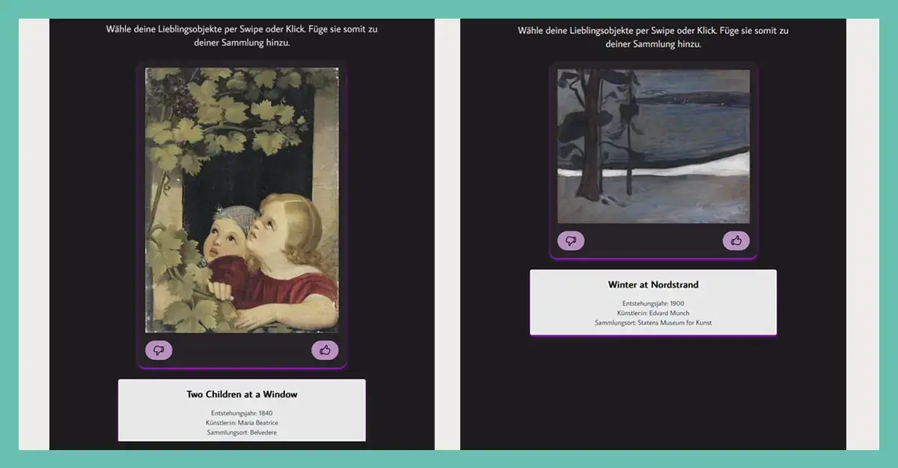

Unsere Zeit mit dem Prototype Fund endet. Vielen Dank an das Team vom Prototype Fund 🙂 Wir haben viel gelernt und ausprobiert. Und natürlich machen wir mit dem Projekt GLAMorous Europe weiter! Zukünftig erweitern wir die Anwendung um Filteroptionen, eine personalisiertere Wikidata-Abfrage, einen Newsfeed für aktuelle GLAM-Austellungen sowie weitere Bearbeitungsoptionen in der Leinwand.

Das Ganze möchten wir gern mit Interessierten und Aktiven aus dem Museums- und Kulturbereich weiterentwickeln und anwenden. Wir können uns auch gut vorstellen, GLAMorous Europe zu einer Medienstation für konkrete GLAM-Einrichtungen zu optimieren. Klingt gut? 👉 Dann schreibt uns gern an und gebt die Info weiter!

🖼 Prager Burg – Hradschin, Alois von Saar, undatiert.
