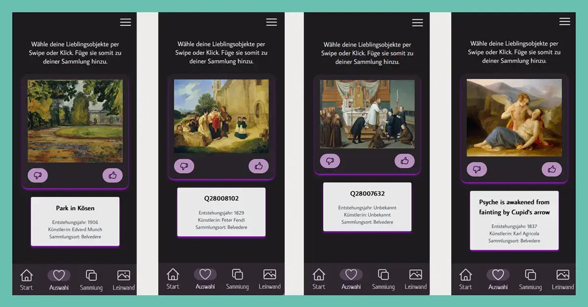

Nach sechs Monaten Arbeit an <a href='/projects/glamorous-europe/'>**GLAMorous Europe**</a> und ein paar Monaten Pause seit dem Launch des Prototypen, in der wir erstmal an anderen Projekten weitergearbeitet haben, stellt sich für uns die Frage, wie wir mit dem Projekt weitermachen wollen.

Zum einen haben wir uns in letzter Zeit auf einige Konferenzen beworben, um das Projekt vorzustellen und insbesondere mögliche Kooperationen und Weiterentwicklungsoptionen für GLAMs aufzuzeigen.
So würden wir <a href='/projects/glamorous-europe/'>**GLAMorous Europe**</a> gerne auf der Wikimania in Katowice im August vorstellen, da das Projekt durch die Verwendung der Wikidata-Datensätze quasi an das Wikiversum angebunden ist und wir dort vielleicht auch hilfreiche Kontakte und Hinweise zur Optimierung finden könnten. Auch auf eine Projektpräsentation auf der CIDOC im November 2024 in Amsterdam haben wir uns beworben.

Zum anderen möchten wir zeitnah einige grundlegende Probleme der Anwendung lösen, die ebenfalls insbesondere mit der Einbindung von Wikidata einhergehen.

Das betrifft das Problem der fehlenden englischen Betitelung sowie die Unausgewogenheit der angezeigten Kunstwerke.

### Fehlende englische Betitelung

Es gibt einige große Datensätze, z.B. aus dem Belvedere in Wien, die nicht standardmäßig mit englischen Titeln ausgestattet wurden beim Upload.
Das ist insofern schade, als dass die englischen Titel eigentlich zum Standard bei der Datenpflege in Wikidata zählen.
Auch deshalb haben wir uns dafür entschieden, in <a href='/projects/glamorous-europe/'>**GLAMorous Europe**</a> immer die englischen Titel anzuzeigen, da diese am häufigsten überhaupt gepflegt sind.
Oft gibt es keine deutsche Übersetzung der Titel und dann hätte man häufig wechselnde Sprachen in der Titelanzeige.

Im Falle der fehlenden englischen Titel führt es jedenfalls dazu, dass nun stattdessen in unserer Webanwendung die Datensatznummer aus Wikidata angezeigt wird (auch Q-Nummer genannt, weil sie mit einem Q beginnt).
Um dieses Problem anzugehen, habe ich angefangen, mich mit der Datenpflege in Wikidata zu beschäftigen und dazu an einer sogenannten Carpentry-Lesson (also quasi einem Einstiegskurs für Wikidata) teilzunehmen.
Dabei habe ich feststellen dürfen, dass Datenpflege in Wikidata sehr einfach ist und viel niedrigschwelliger möglich als beispielsweise bei Wikipedia.
Somit habe ich angefangen, die Titel der betreffenden Kunstwerke ins Englische zu übersetzen bzw. deren englische Titel hinzuzufügen.
Da das Handarbeit ist, konnte ich das bisher erst für rund 200 Objekte realisieren (alles Objekte aus dem Belvedere Wien!). Dadurch fällt inzwischen direkt eine Verbesserung bei den in <a href='/projects/glamorous-europe/'>**GLAMorous Europe**</a> angezeigten Kunstwerken auf.

Zumal die Sammlung des Belvedere aktuell sehr großen Raum in unserem Projekt einnimmt - somit kommen wir zu unserem zweiten Wikidata-Problem:

### Unausgewogenheit der angezeigten Kunstwerke

Aufgrund der Datenabfrage von <a href='/projects/glamorous-europe/'>**GLAMorous Europe**</a> per Graph QL, erhalten wir die Kunstwerke nur so gut ausgespielt, wie unsere Abfrage-Query formuliert ist.

Momentan haben wir bisher keine gute Lösung dafür gefunden, wie wir bereits aus dieser Abfrage eine möglichst vielfältige Sammlung an Kunstwerken angezeigt bekommen.
Vielfältig heißt für uns: Kunstwerke verschiedener Datengeber (GLAMs), aus möglichst diversen Ländern und möglichst unterschiedlichen Kunstgattungen.
Wir hoffen dafür im Laufe des Jahres eine funktionierende Lösung zu finden, die nicht zu einem Time-Out aufgrund der großen Datenmenge von Wikidata führt.

### Und jetzt?

Wir haben zahlreiche Ideen für Optimierungen, Anpassungen und Erweiterungen, die sich an verschiedenen Zielgruppen richten könnten. Beispielsweise würden wir gern die angezeigten Bilder und Künstler:innen mit den dazugehörigen Wikipedia-Artikeln verknüpfen. Außerdem möchten wir perspektivisch einen Feed integrieren, der Nutzer:innen aktuelle Ausstellungen empfiehlt, die zu den favourisierten Kunstwerken passen. Und wir wollen die angezeigten Kunstwerke stärker auf die Auswahl der Nutzer:innen ausrichten und somit zielgerichteter Kunstwerke anzeigen, die für die jewielige Person von Interesse sein könnten. Last but not least können wir uns auch die Integration einer Login-Funktion vorstellen, die Nutzer:innen ermöglicht, später an angefangenen Collagen weiter zu arbeiten oder sogar gemeinsam mit anderen an einem Kunstwerk zu arbeiten.

Daher wollen wir <a href='/projects/glamorous-europe/'>**GLAMorous Europe**</a> gern mit Interessierten und Aktiven aus dem Museums- und Kulturbereich weiterentwickeln und anwenden.
Ihr fühlt euch dabei angesprochen? Dann schreibt uns gern an und gebt die Info weiter!

### Update vom 30. Juni 2024

Wir hatten schon gar nicht mehr mit einer Rückmeldung gerechnet, aber Taaadaaa! wir wurden tatsächlich sowohl für die Wikimania als auch für die CIDOC angenommen.
Auf der Wikimania dürfen wir unser Projekt <a href='/projects/glamorous-europe/'>**GLAMorous Europe**</a> im Rahmen eines Lightning Talks auf großer Bühne präsentieren.
Bei der CIDOC in Amsterdam dürfen wir ein Video unserer Präsentation einreichen.
Über beides freuen wir uns riesig!
