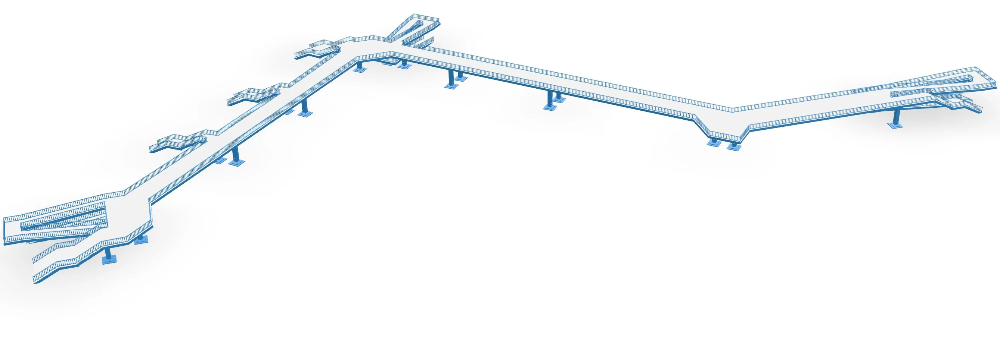

**Blaues WundAR – Ein Kunstprojekt von Maix Mayer**

Die AR-Anwendung **Blaues WundAR** ermöglicht es, die 2004 abgerissene Fußgängerbrücke am Goerdelerring, von den Leipzigern aufgrund seiner Farbe liebevoll "Blaues Wunder" genannt, durch Augmented Reality wiederauferstehen zu lassen.

_Credit: Bundesarchiv, Bild 183-M0828-0009/Raphael (verehel. Grubitzsch), Waltraud/CC-BY-SA 3.0, CC BY-SA 3.0 de, via Wikimedia Commons_

Das Blaue Wunder erlangte in der Geschichte der Stadt Leipzig eine besondere Bedeutung während der Montagsdemonstrationen 1989, die unter der Brücke hindurchführten. Am 9. Oktober 1989 demonstrierten in Leipzig mehr als 70.000 Menschen für Freiheit und Demokratie. Von der Brücke aus entstanden bekannte Fotografien der Demonstrationszüge, da dieser Standpunkt das Fotografieren der Menschenmengen in voller Breite ermöglichte.

**Blaues WundAR** wurde als App mit Unity umgesetzt, um eine möglichst genaue GPS-Lokalisierung und damit zielgenaue Darstellung der 3D-Ansicht der Fußgänger-Brücke am originalen Standort zu gewährleisten.

**Blaues WundAR** ist ein Kunstprojekt von [Maix Mayer](https://maixmayer.studio/) und entstand im Rahmen des Lichtfest Leipzig 2024 anlässlich 35 Jahre Friedliche Revolution. Das Projekt wurde gefördert von der Beauftragten der Bundesregierung für Kultur und Medien und technisch umgesetzt mit [seige.digital GbR](https://seige.digital/) in Zusammenarbeit mit Wilhelm Herbrich und uns, dem Digitalwarenkombinat.

Hier geht´s zur Projektseite von [Blaues WundAR.](https://blaueswunder.maixmayer.studio/)

**Blaues WundAR** ist momentan verfügbar im Apple App Store und demnächst auch im Google Play Store.
