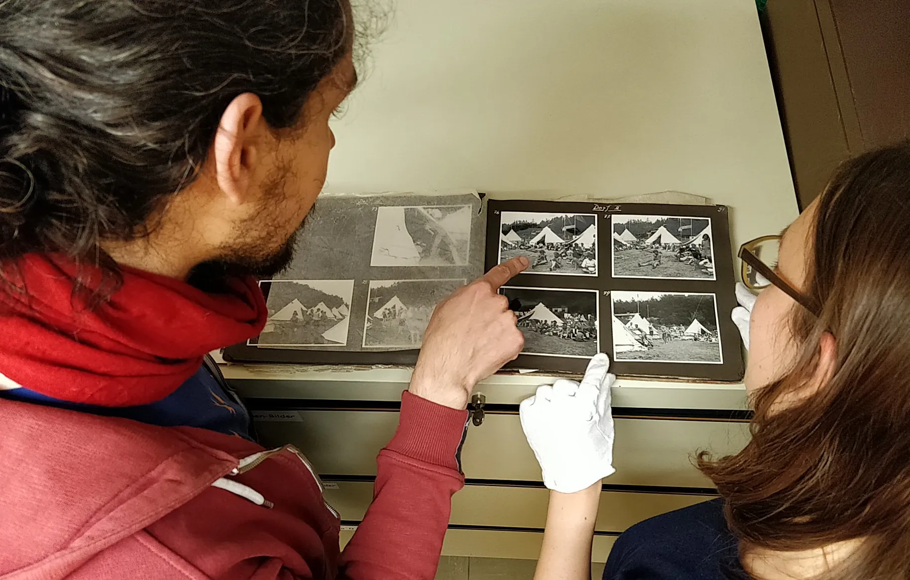

**Demokratie erLeben** begleitet drei Kinder aus der Arbeiterklasse gegen Ende der 1920er Jahre auf ihrem Weg zu einer Kinderrepublik – einem sozialistischen Zeltlager.

Als Scrollytelling-Website realisiert, begleiten wir bei **Demokratie erLeben** Anna, Karl und Gerda auf ihrer Reise in ein Zeltlager der sozialdemokratischen Organisation der _Reichsarbeitsgemeinschaft der Kinderfreunde_. In dieser so genannten _Kinderrepublik_ erleben sie viele spannende Dinge und lernen Demokratie durch eigenes Handeln kennen.

Die Geschichte der drei Kinder wurde ausgestaltet mit vielen kleinen Trickfilmen, Minigames und Soundscapes, die den Alltag in einer Kinderrepublik als Ort der demokratischen Kinder- und Jugendbildung in der Weimarer Republik erlebbar machen.

**Demokratie erLeben** wurde im Rahmen des Kulturhackathons _Coding da Vinci Westfalen-Ruhrgebiet_ 2019 entwickelt. Das Projekt basiert auf Fotos und Material des Archivs der Arbeiterjugendbewegung in Oer-Erkenschwick. 2020 haben wir das Projekt im Rahmen eines Stipendiums des Coding da Vinci für die Zwecke des Archivs ergänzt und ausgebaut.

Hier geht´s zu [Demokratie erLeben.](https://demokratie-erleben.arbeiterjugend.de/)

Das Repository findet ihr auf [Github](https://github.com/gerdesque/demokratieerleben2020)

**Demokratie erLeben** ist momentan verfügbar auf Deutsch und Englisch.
