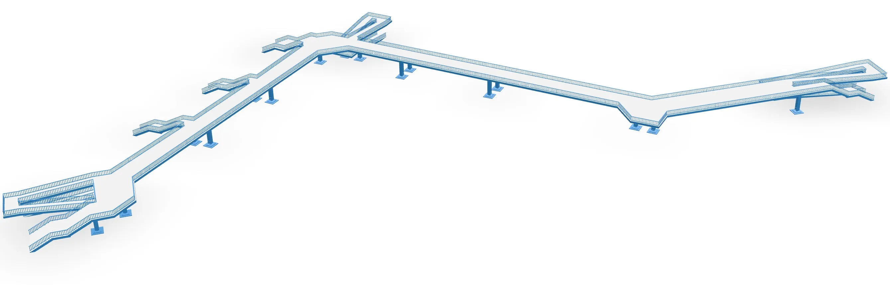

**Blaues WundAR – An art project by Maix Mayer**

The AR application **Blaues WundAR** makes it possible to digitally resurrect the pedestrian bridge on Goerdelerring, which was demolished in 2004 and is affectionately called the “Blue Wonder” by the people of Leipzig because of its color, using augmented reality.

_Credit: Bundesarchiv, Bild 183-M0828-0009/Raphael (verehel. Grubitzsch), Waltraud/CC-BY-SA 3.0, CC BY-SA 3.0 de, via Wikimedia Commons_

The Blue Wonder gained special significance in the history of the city of Leipzig during the Monday demonstrations in 1989, which passed under the bridge. On October 9, 1989, more than 70,000 people demonstrated for freedom and democracy in Leipzig. Famous photographs of the demonstrations were taken from the bridge, as this viewpoint allowed the crowds to be photographed in their entirety.

**Blaues WundAR** was implemented as an app with Unity in order to ensure the most accurate GPS localization possible and therefore the most accurate representation of the 3D view of the pedestrian bridge at its original location.

**Blaues WundAR** is an art project by [Maix Mayer](https://maixmayer.studio/) and was created as part of the Leipzig 2024 Light Festival to mark 35 years of the Peaceful Revolution. The project was funded by the Federal Government Commissioner for Culture and the Media and technically realised with [seige.digital GbR](https://seige.digital/) in collaboration with Wilhelm Herbrich and us, the Digitalwarenkombinat.

Click here for the project page of [Blaues WundAR.](https://blaueswunder.maixmayer.studio/)

**Blaues WundAR** is currently available in the Apple App Store and will soon be available in the Google Play Store.
