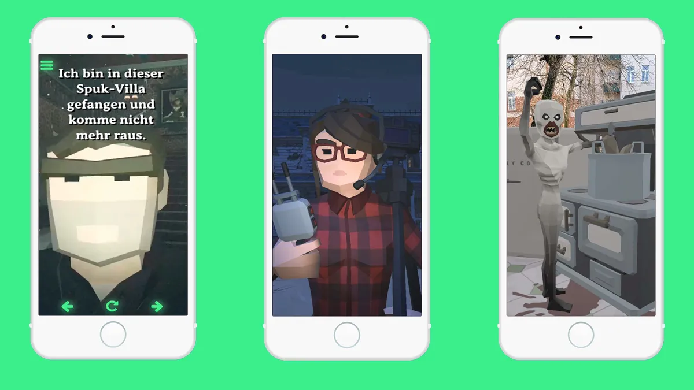

The **Spook Tours** are cooperative GPS-based scavenger ghost hunts that can be played individually or as a team.

Our first **Spook Tour** takes users to paranormal locations in Leipzig's Friedenspark, where demons, ghosts and other paranormal creatures are up to mischief and puzzles have to be solved.

The aim of the **Spook Tour** is to decode a secret message and free amateur ghost hunter Holger from the haunted mansion.

A total of ten spooky AR scenes are waiting to be explored and decoded. Each scene contains the translation for an occult rune, which can be used to decode the secret message at the end.

The **Spook Tours** work as a browser-based web app and can be played with up to 3 people.

**Spook Tours** is a production of [GEOMAZING](https://geomazing.com/), which was created in cooperation with the **Digitalwarenkombinat**.

Click here for the [Spook Tour with direct booking option.](https://www.gregorassfalg.de/spooktour/)

You can find the repository on [Github.](https://github.com/digitalwarenkombinat/ghosthunt)

Our first **Spook Tour** is currently available in German and English.
