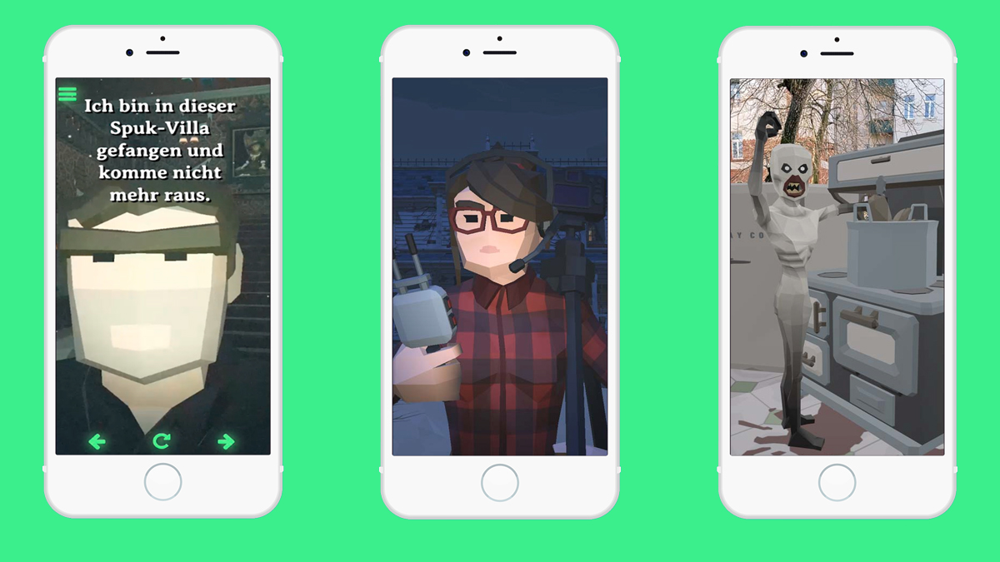

Die **Spook Tour** ist eine kooperative GPS-basierte Geisterjagd, die einzeln oder als Team mit bis zu drei Personen gespielt werden kann.

Unsere erste Spook Tour führt die Nutzer:innen an paranormale Orte im Leipziger Friedenspark, wo Dämonen, Geister und andere paranormale Kreaturen ihr Unwesen treiben und Rätsel gelösen werden müssen.

Ziel des Spiels ist es, eine geheime Botschaft zu entschlüsseln und Hobby-Geisterjäger Holger aus der Spuk-Villa zu befreien.

Insgesamt warten zehn schaurige AR-Szenen darauf, erkundet und entschlüsselt zu werden.
Jede Szene enthält die Übersetzung für eine okkulte Rune, mit der am Ende die geheime Botschaft entschlüsselt werden kann.

Die browserbasierte Webapp kann mit bis zu 3 Personen gespielt werden.

**Spook Tours** ist eine Produktion von **GEOMAZING**, die in Kooperation mit der **Digitalwarenkombinat GbR** erstellt wurde.

Hier geht es zur **Spook Tour** mit direkter Buchungsoption: https://www.gregorassfalg.de/spooktour/

Repository auf Github: https://github.com/digitalwarenkombinat/ghosthunt
